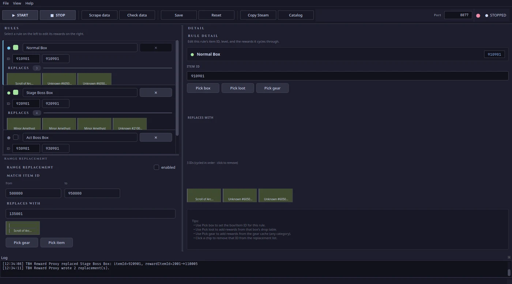
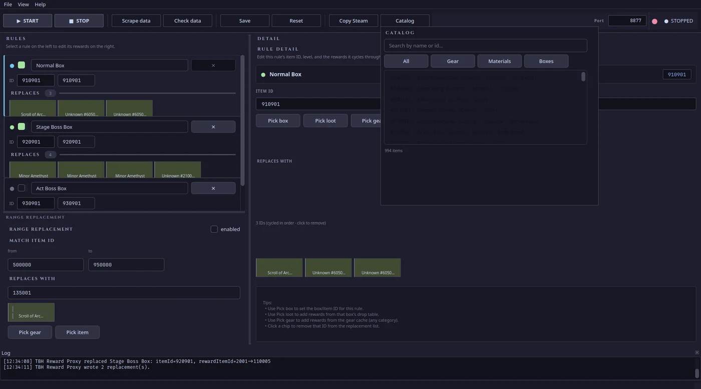
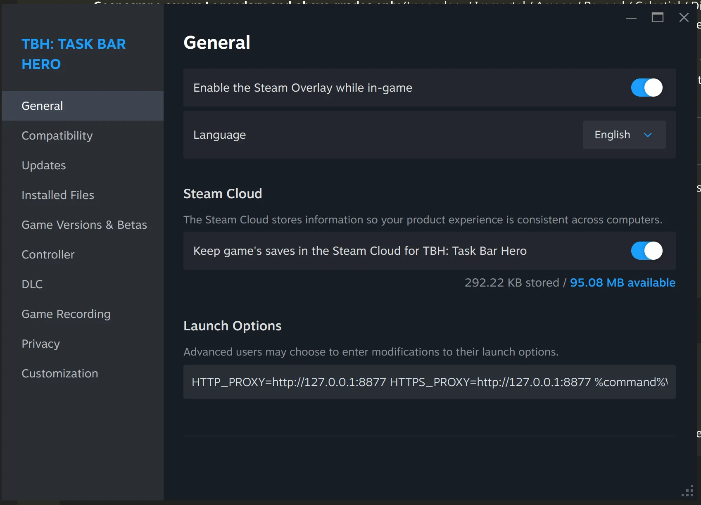

# TBH Reward Proxy

> **⚠️ DWYOR — Do With Your Own Risk**
>
> This tool intercepts and modifies game network traffic. Using it may violate
> the game's Terms of Service and **can result in your account being banned**.
> The authors are not responsible for any consequences. Use at your own risk.


[English](README.md) · [Bahasa Indonesia](README.id.md)

## ❤️ Support

If this project helped you, consider supporting development — scan the QRIS below or visit [qrisly.net/kcmon](https://qrisly.net/kcmon):


A man-in-the-middle proxy that rewrites the `rewardItemId` field in TBH game
backend responses. Built on top of [mitmproxy](https://mitmproxy.org/), with an
optional [PySide6](https://www.qt.io/) desktop GUI for visual rule editing,
reward-ID picking from the wiki, and live proxy control.

The addon sits between the game client and the TBH backend, swaps reward items
per the rules in `config.json`, and forwards the modified response back. No
patching, no injection — just a network proxy.

---

## Table of Contents

- [How It Works](#how-it-works)
- [Quick Start](#quick-start)
- [Configuration](#configuration)
  - [Specific Rules](#specific-rules)
  - [Range Rules](#range-rules)
- [Running the Proxy](#running-the-proxy)
  - [Hot Reload](#hot-reload)
- [Anti-Cheat Awareness](#anti-cheat-awareness)
  - [Suffix System](#suffix-system)
  - [Suffix-Aware Picker](#suffix-aware-picker)
  - [Tamper Monitoring](#tamper-monitoring)
- [Desktop App](#desktop-app)
  - [Install & Launch](#desktop-install)
  - [UI Tour](#ui-tour)
  - [Features](#desktop-features)
  - [Hot-Reload Interaction](#desktop-hot-reload)
  - [Known Limitations](#desktop-limitations)
- [Steam Client Setup (TaskBarHero via Proton)](#steam-client-setup)
- [CA Certificate](#ca-certificate)
- [Self-Test](#self-test)
- [Troubleshooting](#troubleshooting)
- [Security Warning](#security-warning)
- [File Structure](#file-structure)
- [Acknowledgements](#acknowledgements)

---

## How It Works

The addon hooks mitmproxy's `response` event. Filter pipeline:

1. **Method filter** — if `only_post: true`, only POST is processed.
2. **URL filter** — response URL must contain one of the markers in `url_contains`.
3. **Body marker filter** — if `require_boxes_marker: true`, body must contain literal `"boxes"`.
4. **Rewrite** — regex finds `"itemId":<n>` then `"rewardItemId":<m>` after it. If itemId matches a rule, replace `rewardItemId` with a value from `replacement_reward_item_ids` (cycled per match).
5. **Write back** — `response.set_text()` with the new body.

```
Client --POST--> [mitmproxy:8877] --forward--> TBH Backend
                      |
                      v
                 response (JSON boxes)
                      |
                 hook: rewrite rewardItemId
                      |
Client <--mod response-- [mitmproxy:8877]
```

Rule priority: **specific rules first, then range**. Specific rules match
`itemId` exactly; range matches `[match_min_item_id, match_max_item_id]`.

The regex uses backslash escaping to handle JSON that may be escaped
(`\"itemId\"` as well as `"itemId"`).

---

## Quick Start

```bash
# 1. Install mitmproxy (Arch / CachyOS)
sudo pacman -S mitmproxy

# 2. Verify
mitmdump --version
python3 src/tbh_reward_hook.py --self-test

# 3. Run the proxy
mitmdump -s src/tbh_reward_hook.py --listen-port 8877 \
    --set block_global=false -q

# 4. Point the game client at 127.0.0.1:8877 (HTTP/HTTPS proxy)
```

For a visual workflow with rule editing and reward-ID picking, see
[Desktop App](#desktop-app).

---

## Configuration

Edit `src/config.json`. Shape:

```json
{
  "listen_port": 8877,
  "only_post": true,
  "require_boxes_marker": true,
  "url_contains": ["/backend-function/base/v1"],
  "specific_queue_rules": [
    {
      "enabled": true,
      "name": "Normal Box",
      "item_id": 910801,
      "level": 12,
      "replacement_reward_item_ids": [135001, 605041, 605051]
    }
  ],
  "range_replacement": {
    "enabled": false,
    "name": "Range replacement",
    "match_min_item_id": 500000,
    "match_max_item_id": 950000,
    "replacement_reward_item_ids": [529191, 419191, 409191]
  }
}
```

`level` is optional (used by the desktop picker to scope gear matches to the
box's level range; the addon itself ignores it).

### Specific Rules

Matches `itemId` exactly. Each match consumes one value from
`replacement_reward_item_ids` cyclically (index modulo list length).

Example: Normal Box `910801` with replacements `[135001, 605041, 605051]`.
The first Normal Box hit becomes `135001`, the second `605041`, the third
`605051`, the fourth wraps back to `135001`, and so on.

### Range Rules

`enabled: false` by default. When active, matches `itemId` within
`[match_min_item_id, match_max_item_id]`. Priority: specific rules evaluated
first; if no match, check range.

Cycling is identical: one value per match, modulo list length.

---

## Running the Proxy

```bash
./scripts/run_proxy.sh          # Linux
windows\run_proxy.bat           # Windows
```

Or directly:

```bash
mitmdump -s src/tbh_reward_hook.py --listen-port 8877 \
    --set block_global=false -q
```

Sample output:

```
[TBH] TBH Reward Proxy loaded: 1 specific rules active, range=off.
[TBH] TBH Reward Proxy replaced [Normal Box] itemId=910801: rewardItemId=1001->135001
[TBH] TBH Reward Proxy wrote 1 replacement(s).
```

Stop with `Ctrl+C`. Point the target client at proxy `127.0.0.1:8877`.

### `--mode local` (scoped spawn, no Steam Launch Options)

mitmproxy's `--mode local:NAME` spawns the named executable with proxy env
and CA auto-injected, then intercepts only that process's traffic. Useful
on Windows where editing Steam Launch Options is awkward, or any time you
want scoping without touching system proxy settings.

```bash
# CLI
./scripts/run_proxy.sh --mode local --name TaskBarHero.exe
windows\run_proxy.bat --mode local --name TaskBarHero.exe
```

Or in `src/config.json`:

```json
{
    "mode": "local",
    "local_process_name": "TaskBarHero.exe",
    "listen_port": 8877
}
```

- **Windows**: works out of the box. Recommended over Steam Launch Options.
- **Linux**: mitmproxy's local redirector uses a setuid helper, so mitmdump
  will prompt for `sudo` at startup. Run as root or pre-elevate:
  `sudo -E ./scripts/run_proxy.sh --mode local --name <proc>`.

### Hot Reload

`config.json` is **hot-reloaded** — no proxy restart needed. The addon checks
the file mtime on every intercepted response and reloads when it changes.

- Edit `config.json`, save → next request picks up the new rules. Log:
  `TBH Reward Proxy reloaded: ...`.
- Manual reload without editing: `pkill -HUP -f mitmdump`.
- **Corrupt config safety**: if `config.json` is invalid (bad JSON, wrong
  types), the addon keeps the **last good config** running and logs
  `kept previous config (config.json invalid)`. A bad edit never breaks
  active interception. Fix the file and save to reload.
- If `config.json` is missing/corrupt at startup, the proxy boots with an
  empty fallback config (no rules) and logs `using fallback empty config`.

You only need to restart the proxy to change `listen_port` (mitmproxy binds
the port at startup).

---

## Anti-Cheat Awareness <a id="anti-cheat-awareness"></a>

The TBH client ships a **client-side anti-cheat validator**. After
`processBoxV2` mints a pending reward, the client caches
`<itemKey, rewardItemId>`. On any subsequent inventory operation
(`consume`, `exchange`, or opening another box's pending), the client
cross-checks the cached `rewardItemId` against the server-truth value
derived from `pendingTx.tid`. If they disagree, it sends:

```
POST /data/gameLog/v2/TemperedItem/90
{"msg":"TamperedItemIdDetected","data":{"mismatches":["<itemKey>:<orig>-><used>", ...]}}
```

The server returns `204 No Content` — it just logs. **No ban has been
observed yet**, but repeated reports accumulate a trail. Full forensics
in [`docs/analysis/tbh-network-forensics.md`](docs/analysis/tbh-network-forensics.md).

### Suffix System <a id="suffix-system"></a>

The client validator checks only the **last 3 digits** of `rewardItemId`
(rarity × 100 + tier), not the full 6-digit ID. ItemId structure:

```
ABCDEF where:
  AB  = 2-digit category (30=sword, 50=helmet, 60=amulet, etc.)
  C   = rarity (0=Common ... 9=Cosmic) ← this is what the validator checks
  DEF = tier + slot (3-digit)
```

**Rule**: pick replacements whose last-3 digits match the original
drop's last-3 digits. The category (first 2 digits) can change freely.

| Original drop | Safe replacement | Suffix |
|---|---|---|
| `319171` (Cosmic Bow) | `419171` (Cosmic Axe) | `171` ✓ |
| `190004` (Soulstone Torment) | `114004` (Emerald) | `004` ✓ |
| `311171` (Uncommon Bow) | `419171` (Cosmic Axe) | `171` ✓ |

| Original drop | Dangerous replacement | Why |
|---|---|---|
| `190004` | `419171` | suffix `004`→`171` = MISMATCH = tamper report |

Box suffix pools (verified from captures):

| Box kind | Dominant suffixes |
|---|---|
| Normal Box (`910801`) | `171`, `017`, `004`, `003`, `001` |
| Stage Boss Box (`920801`) | `004` (heavy), `017`, `171` |

### Suffix-Aware Picker <a id="suffix-aware-picker"></a>

Both the **BoxLootPicker** and **GearPicker** dialogs have a new
"Suffix-aware" checkbox. When enabled:

- Each row displays a `~XXX` badge showing the last-3 digits
- A "Suffix:" dropdown appears — filter items by suffix
- Use it to narrow to items whose suffix matches the original drop's
  suffix, so you only pick validator-safe replacements

When disabled, the picker behaves as before (no suffix noise).

**Recommended workflow**:
1. Check the original reward's suffix (from capture data or the table above)
2. Enable "Suffix-aware" in the picker
3. Select the matching suffix in the dropdown
4. Pick a high-value item from the filtered list

### Tamper Monitoring <a id="tamper-monitoring"></a>

The addon includes a **passive TamperDetector** that:

- Watches `POST /data/gameLog/v2/TemperedItem/90` responses
- Logs each mismatch to `logs/tamper-events.jsonl` with structured
  fields: `itemKey`, `original_id`, `used_id`, `original_rarity`,
  `used_rarity`, `original_tier`, `used_tier`, `last3_preserved`
- Prints `TAMPER WARNING: N mismatch(es)... Session total: M` to stdout
  (visible in the desktop log panel)

In the **desktop app**, the status bar shows a live counter:
`⚠ Tamper reports this session: M`. The counter resets when a new proxy
session starts.

If you see tamper reports: your replacement IDs have mismatched suffixes.
Use the suffix-aware picker to fix your config.

---

## Desktop App

An optional PySide6 GUI that wraps the same `config.json` and `run_proxy.py`
the CLI uses. Lets you edit rules visually, pick reward IDs from the TBH
wiki/loot tables, and run the proxy without leaving the window.

It does **not** replace the proxy addon — the GUI spawns `src/run_proxy.py`
as a subprocess and streams its stdout. The same hot-reload rules apply.

### Install & Launch <a id="desktop-install"></a>

Desktop deps are intentionally separate from `requirements.txt` (mitmproxy) so
the proxy install stays light. The desktop app needs:

| Package | Purpose |
|---|---|
| `PySide6` | GUI framework |
| `requests` + `beautifulsoup4` + `lxml` | Wiki HTML scraping |
| `playwright` + `cloakbrowser` | Stealth browser engine for gear scrape |
| `pytest-qt` | GUI tests |
| `Pillow` | Image cache (used by ItemCard icons) |

#### Linux (Arch / CachyOS / any distro)

The launcher (`scripts/launch_desktop.sh`) does **not** require a venv.
It resolves a Python interpreter at the repo root in this order:

  1. `<repo>/.venv/bin/python` — if you created a venv, it's used
  2. `python3` on PATH
  3. `python` on PATH

Pick whichever path matches your setup:

**Option A — system Python (no venv):** install the desktop deps globally
and launch directly. Works on Arch where most deps are packaged:

```bash
sudo pacman -S python-pyside6 python-requests python-beautifulsoup4
python -m pip install --break-system-packages -r requirements-desktop.txt
./scripts/launch_desktop.sh
```

> `playwright` and `cloakbrowser` are pip-only — no pacman package.
> Use `--break-system-packages` (or `pipx`) because PEP 668 blocks
> system-wide pip installs by default on Arch.

**Option B — virtual environment (recommended for isolation):**

```bash
cd TBH
python -m venv .venv
.venv/bin/pip install -r requirements-desktop.txt
./scripts/launch_desktop.sh          # checks + launch
./scripts/launch_desktop.sh --check  # checks only, no launch
```

The launcher verifies Python, deps, mitmproxy, `config.json`, and
CloakBrowser binary before starting. If anything is missing, it prints
the exact fix command — using whichever interpreter was resolved (venv
or system), so the hint is always actionable.

**Or launch manually** (skip readiness checks):

```bash
.venv/bin/python -m tbh_desktop.main
```

**Step 3 — (Optional) Install Playwright browser engine for fallback:**

CloakBrowser downloads its own stealth Chromium binary on first launch
(~200 MB, cached locally). You only need `playwright install chromium` if you
want the stock-Playwright fallback (used when CloakBrowser is not installed):

```bash
.venv/bin/playwright install chromium
```

> **Note for Arch users:** PySide6, python-requests, and python-beautifulsoup4
> are also available via pacman (`sudo pacman -S pyside6 python-requests
> python-beautifulsoup4`), but using the venv is simpler and avoids PEP 668
> issues. `playwright` and `cloakbrowser` are pip-only — no pacman package.

#### Windows

The launcher (`windows\launch_desktop.bat`) does **not** require a venv.
It resolves a Python interpreter at the repo root in this order:

  1. `<repo>\.venv\Scripts\python.exe` — if you created a venv, it's used
  2. `py` (Windows Python Launcher) on PATH
  3. `python` on PATH

Pick whichever path matches your setup:

**Option A — system Python (no venv):** install the desktop deps globally
and launch directly.

```bat
python -m pip install -r requirements-desktop.txt
windows\launch_desktop.bat
```

**Option B — virtual environment (recommended for isolation):**

```bat
cd TBH
python -m venv .venv
.venv\Scripts\pip install -r requirements-desktop.txt
windows\launch_desktop.bat            :: checks + launch
windows\launch_desktop.bat --check   :: checks only
```

> If `python` is not found, try `py -3 -m venv .venv` (uses the py launcher).

The launcher verifies Python, deps, mitmproxy, `config.json`, and
CloakBrowser binary before starting. If anything is missing, it prints
the exact fix command.

**Or launch manually:**

```bat
.venv\Scripts\python -m tbh_desktop.main
```

**Step 3 — (Optional) Install Playwright browser engine for fallback:**

```bat
.venv\Scripts\playwright install chromium
```

Same as Linux — only needed for the stock-Playwright fallback. CloakBrowser
manages its own binary.

#### CloakBrowser (stealth scraping engine)

Starting with v0.4+, the gear scraper uses
[CloakBrowser](https://github.com/CloakHQ/CloakBrowser) — a stealth
Chromium build with 58 C++ source-level anti-detection patches — as the
scraping engine. It is a drop-in replacement for Playwright's
`chromium.launch()` and downloads its own patched binary on first use
(~200 MB, cached locally, Ed25519-verified). No separate `playwright
install` step is needed for CloakBrowser, but the `playwright` Python
package must still be installed (CloakBrowser depends on it for its
Playwright-compatible API).

CloakBrowser benefits over stock Playwright for scraping:

- Passes Cloudflare Turnstile, reCAPTCHA v3 (0.9 score), FingerprintJS, BrowserScan
- `humanize=True` — human-like Bézier mouse curves, per-character keyboard timing, realistic scroll
- `navigator.webdriver` patched to `false` at the C++ source level
- TLS fingerprint identical to real Chrome (ja3n/ja4/akamai match)

If CloakBrowser is not installed (`pip install cloakbrowser`), the scraper
falls back to stock Playwright `chromium.launch()` automatically. The
`playwright install chromium` step is only needed in that fallback case.

The proxy addon itself (`requirements.txt` / `mitmproxy`) is still required
if you want Start/Stop to work — see [Quick Start](#quick-start) above.

### UI Tour <a id="ui-tour"></a>



The shell is composed of four zones, each with a distinct job:

| Zone | Location | Purpose |
|---|---|---|
| **Toolbar** | Top | Start/Stop proxy · Scrape data · Check data · Save · Reset · Copy Steam launch option · Open catalog popup · Port field · Status badge |
| **RULES panel** (left) | Splitter 30% | List of `specific_queue_rules` as cards, plus the `range_replacement` form at the bottom. Click a rule to load it into the detail panel. |
| **DETAIL panel** (right) | Splitter 70% | Per-rule editor: item ID, level, three Pick buttons (box / loot / gear), and the replacement-ID chip row. Click a chip to remove that ID. |
| **Log dock** | Bottom (collapsible, 80px max) | Streamed stdout from the proxy subprocess + scrape events. Toggled via `View → Log panel`. |

The **status badge** (top-right of the toolbar) is the authoritative proxy
state indicator: a colored dot + `STOPPED` / `RUNNING` label. The Start
button is enabled only when the proxy is stopped; Stop is enabled only
when it's running.



The **Catalog popup** is a single-page search-first browser for the in-game
item catalog. Click the toolbar's `Catalog` button to open it; click outside
to dismiss. It merges three data sources into one flat list:

- Gear cache (`tbh_desktop/gear/{category}/{rarity}.json`)
- Drops index (`tbh_desktop/drops_index.json` — materials + boxes)
- Box slug cache (`tbh_desktop/box_slug_cache.json`)

Filter chips (`All` / `Gear` / `Materials` / `Boxes`) narrow the result list.
Rows are sorted by rarity (Cosmic → Common) and tinted by rarity so high-tier
drops are visually obvious. Single-click or double-click a row to route the
item's ID into the active target (the rule you're currently editing, or the
range form if it has focus).

### Features <a id="desktop-features"></a>

- **Dark theme** — Catppuccin Mocha palette applied app-wide. Consistent
  colors for buttons, tables, lists, inputs, log panel, and pickers. The
  log panel uses a FiraCode/JetBrainsMono monospace font on a darker crust
  background for terminal-like readability.

- **2-pane shell** — `RULES` (left, ~30%) + `DETAIL` (right, ~70%) with a
  6px draggable splitter. Drag to resize; the splitter has a visible
  surface1 background so it can actually be grabbed (Qt's default 4px
  invisible handle confuses users into thinking the layout is fixed).

- **Detail panel** — the primary edit surface. Populates with the selected
  rule's name, item ID, level, and replacement chip row. Three pick
  buttons open the corresponding modal picker:
  - **Pick box** → `BoxPicker` (choose a stage chest by id)
  - **Pick loot** → `BoxLootPicker` scoped to that box's drop table
  - **Pick gear** → `GearPicker` filtered by the box's level range

- **Rule list** — each rule is a self-contained `RuleCard` with its own
  enable toggle, name field, item_id field, REPLACES badge, and chip row.
  The chip row mirrors what's in the detail panel — both stay in sync
  because they share the same `RuleCard` data source.

- **Range form** — lives at the bottom of the left panel (single, since
  `range_replacement` is a singleton). Focus the form to switch the
  detail panel to "Range replacement" summary state.

- **Atomic save** — validates against `ProxyConfig.load` before and after
  writing. Backups the previous file as `config.json.bak`, writes via temp
  + rename, restores from backup on re-validation failure. A bad save
  never breaks active interception.

- **Edit `src/config.json` visually** — the editor owns `specific_queue_rules`
  and `range_replacement` only. Advanced fields (`only_post`,
  `require_boxes_marker`, `url_contains`) are **not** exposed in the GUI
  but are **preserved** on save: the editor reads the file as a raw dict
  and only touches the fields it owns.

- **Pick reward IDs** — every `Replacement IDs` cell supports manual
  typing, plus:
  - **Pick box loot** — resolves the box's slug by looking up `box_id` in
    the wiki's items page (`https://taskbarhero.org/en/items` "Stage
    chests" table), fetches the per-box loot table from
    `https://taskbarhero.org/en/items/chests/<id>-<slug>/`, parses it, and
    lets you multi-select items. The id→slug map is cached at
    `tbh_desktop/box_slug_cache.json`; loot is cached per-box at
    `tbh_desktop/box_loot_cache/<box_id>.json`.
  - **Pick gear** — reads from per-category×rarity cache files under
    `tbh_desktop/gear/` (nested layout: `tbh_desktop/gear/{category}/{rarity}.json`,
    e.g. `tbh_desktop/gear/weapon/legendary.json`). Three filters:
    **Category** (Weapon / Off-hand / Armor / Accessory / All),
    **Grade** (Legendary / Immortal / Arcana / Beyond / Celestial /
    Divine / Cosmic / All — Legendary-and-above only), and **Level
    range** (min/max 1-100). Multi-select list and search box preserved.
  - **Pick from catalog** — the toolbar `Catalog` popup merges gear +
    drops index + box slugs into one search-first list with rarity
    filter chips. Pick rows with single-click; they route to the active
    target just like the dedicated pickers.

- **Scrape data** — single button that runs the gear scrape (stealth
  browser, all Legendary+ grades × all categories, "Obtainable only") and
  the drops index fetch in parallel. Logs total counts on completion.
  Falls back to stock Playwright if CloakBrowser isn't installed.

- **Check data** — shows counts, last-fetched timestamps, and disk usage
  for each cache (drops index, gear cache, box drop map) without scraping.
  Useful for "do I need to re-scrape?" at a glance.

- **Suffix-aware picker** — both BoxLootPicker and GearPicker have a
  "Suffix-aware" checkbox. When enabled, each row shows a `~XXX` badge
  (last 3 digits = rarity+tier) and a dropdown filters items by suffix.
  Use it to pick validator-safe replacements (same suffix = no
  `TamperedItemIdDetected`). See [Anti-Cheat Awareness](#anti-cheat-awareness).

- **Tamper counter** — the status bar shows `⚠ Tamper reports this
  session: M`, parsed from the addon's `TAMPER WARNING` stdout lines.
  Resets to 0 when a new proxy session starts. Gives live visibility
  into anti-cheat behavior without scrolling the log panel.

- **Start / Stop proxy** — spawns `src/run_proxy.py` as a subprocess
  (cwd = repo root, own process group). Status badge turns `RUNNING` with
  a green dot; log dock streams stdout in real time (FIFO capped at 10k
  lines). Stop sends SIGTERM to the whole process group, escalates to
  SIGKILL after 3s. If the toolbar port field differs from the saved
  `listen_port` when Start is clicked, the app prompts "Port changed.
  Save config first?" — Yes saves then starts, No aborts. This prevents
  the silent desync where the proxy runs on the old port while the UI
  shows the new one.

- **Copy Steam launch option** — copies the current port into the
  `HTTP_PROXY=... HTTPS_PROXY=... %command%` string, ready to paste into
  Steam → TaskBarHero → Properties → Launch Options. Tooltip updates live
  as you edit the port.

- **Save config** — atomic, validated (see above). Same mtime-based
  hot-reload as a manual edit.

- **Reset config** — restores the default template (after a confirmation
  prompt). If the proxy is running, asks to stop it first.

- **Close confirm** — if the proxy or gear scraper is running, closing
  the window asks before stopping it.

- **Menu** — File (Save config, Reset config to default, Exit). View
  (Log panel toggle, Item browser — opens the Catalog popup). Help
  (About).

### Hot-Reload Interaction <a id="desktop-hot-reload"></a>

The GUI edits the **same** `config.json` the addon reads. Saving from the
GUI bumps the file's mtime, so the addon's per-response mtime check picks
up the new rules on the very next intercepted request — no proxy restart
needed.

Exception: `listen_port`. The toolbar field writes into `config.json` but
mitmproxy binds the port at startup, so changing it requires a proxy
restart (Stop → Start). The Start button now guards against the desync:
if the toolbar port differs from the saved `listen_port` when Start is
clicked, it prompts to save first (Yes saves then starts, No aborts)
rather than starting on the stale saved port.

### Known Limitations <a id="desktop-limitations"></a>

- **Box loot requires a valid `item_id`** in the selected rule row, and
  the box must exist in the wiki's "Stage chests" table on
  `https://taskbarhero.org/en/items`. The slug is resolved by `box_id`
  lookup against that table (cached at
  `tbh_desktop/box_slug_cache.json`), so a matching `name` is no longer
  needed. Rare or new boxes not yet on the wiki will fail the lookup —
  fall back to typing IDs directly into the cell.

- **Scrape data requires CloakBrowser + a browser engine** installed
  (`pip install cloakbrowser`). CloakBrowser downloads its ~200 MB
  patched Chromium binary on first launch (cached locally). Without it,
  the scraper falls back to stock Playwright (`playwright install
  chromium` needed).

- **Gear scrape covers Legendary-and-above grades only** (Legendary /
  Immortal / Arcana / Beyond / Celestial / Divine / Cosmic) across the
  four categories (Weapon / Off-hand / Armor / Accessory). Lower grades
  (Common / Uncommon / Rare) are not scraped by the GUI — type their IDs
  directly if needed.

- **Pickers need network** to fetch fresh data; they fall back to the
  cache on fetch failure (silent — see log panel for the warning).

- The GUI is read-only against the on-disk config; concurrent edits from
  another tool are not detected. If you edit the file outside the GUI
  while it is open, restart the app to re-read.

---

## Steam Client Setup <a id="steam-client-setup"></a>

TaskBarHero is a Windows Unity game (Steam AppId 3678970) running through
Proton + SteamLinuxRuntime_4 + pressure-vessel on Linux. The sandbox
isolates the network namespace and does not forward host proxy env vars
by default.

### Working method: Steam Launch Options (tested, confirmed working)

Steam → right-click **TaskbarHero** → Properties → **Launch Options**, enter:

```
HTTP_PROXY=http://127.0.0.1:8877 HTTPS_PROXY=http://127.0.0.1:8877 %command%
```



Proton forwards these env vars into the Wine process, where Unity's
`HttpClient` picks them up.

The desktop app's `Copy Steam` button copies the same string for the
current toolbar port — no manual editing.

### CA trust inside Proton prefix

Unity/Proton uses the **Wine/Proton Windows cert store**, not the Linux
system trust. Install the mitmproxy CA into the Proton prefix (AppId
3678970):

```bash
WINEPREFIX=~/.local/share/Steam/steamapps/compatdata/3678970/pfx \
  wine certmgr -add -c -root ~/.mitmproxy/mitmproxy-ca-cert.cer
```

If `certmgr` is unavailable in that prefix, copy the cert into the Wine
CA dir:

```bash
PFX=~/.local/share/Steam/steamapps/compatdata/3678970/pfx
cp ~/.mitmproxy/mitmproxy-ca-cert.cer "$PFX/drive_c/windows/system32/cert/CA/"
```

### Notes

- Native Unity sockets (non-HttpClient) may ignore proxy env regardless
  of method.
- AppId 3678970 is a commercial Steam title — intercepting/modifying its
  traffic may violate Steam and/or game ToS. Use only on owned accounts
  in controlled environments.
- If Launch Options env is ignored, alternatives: transparent iptables
  redirect (host layer, requires bypassing pressure-vessel network
  isolation) or Wine proxy registry
  (`HKCU\Software\Microsoft\Windows\CurrentVersion\Internet Settings`).

---

## CA Certificate

mitmproxy intercepts HTTPS using its own CA. Clients must trust this CA,
otherwise certificate errors appear. The CA is generated automatically the
first time `mitmdump` runs, located at `~/.mitmproxy/`.

### Linux (system trust)

Install:

```bash
./scripts/install_cert.sh
```

The script auto-re-execs as sudo, uses `trust anchor --store` +
`update-ca-trust extract`. Verify:

```bash
trust list | grep -i mitmproxy
```

Remove (when no longer intercepting):

```bash
./scripts/remove_cert.sh
```

### Windows (system trust)

Install (auto-elevates to admin via UAC prompt):

```bat
windows\install_cert.bat
```

Uses `certutil -addstore -f "Root"` to add the cert (default:
`%USERPROFILE%\.mitmproxy\mitmproxy-ca-cert.cer`) to the Trusted Root
Certification Authorities store. Override the cert path via
`MITMPROXY_CA_CERT` env var. Verify:

```bat
certutil -store Root | findstr /i mitmproxy
```

If PowerShell is unavailable and the script is not already elevated, it
will print instructions to right-click → "Run as administrator".

> Note: there is no `windows\remove_cert.bat` yet — to remove, open
> `certmgr.msc` → Trusted Root Certification Authorities → Certificates
> → locate `mitmproxy` → Delete.

### Firefox

Firefox has its own store and does not read system trust.

1. `about:preferences#privacy`
2. Certificates → View Certificates → **Authorities** tab
3. Import → `~/.mitmproxy/mitmproxy-ca-cert.pem`
4. Check "Trust this CA to identify websites" → OK

### Chromium / Chrome

Reads system trust (Linux step above is sufficient). Or bypass via flag:

```bash
chromium --ignore-certificate-errors-spki-list=$(openssl x509 -in ~/.mitmproxy/mitmproxy-ca-cert.pem -pubkey -noout | openssl pkey -pubin -outform der | openssl dgst -sha256 -binary | base64)
```

### Other Clients

- **Electron/Node**: `NODE_EXTRA_CA_CERTS=~/.mitmproxy/mitmproxy-ca-cert.pem`
- **Python (requests/urllib)**: `SSL_CERT_FILE=~/.mitmproxy/mitmproxy-ca-cert.pem` or `REQUESTS_CA_BUNDLE=...`
- **Android emulator**: push cert to `/system/etc/security/cacerts/` (different process).
- **Windows client**: import `.cer` via `certmgr.msc` → Trusted Root.

---

## Self-Test

Offline rewrite test without the proxy running. Validates regex + rule
logic against a built-in fixture (does NOT read live `config.json`):

```bash
./scripts/self_test.sh          # Linux
windows\self_test.bat           # Windows
```

Success output (single line):

```
Self-test OK.
```

The self-test uses a hard-coded fixture to exercise the rule engine
end-to-end. Update `run_self_test()` in `src/tbh_reward_hook.py` if you
change rule logic so the test stays meaningful.

---

## Troubleshooting

| Symptom | Cause | Fix |
|---|---|---|
| `ModuleNotFoundError: mitmproxy` | mitmproxy not installed | `sudo pacman -S mitmproxy` / `./scripts/install_requirements.sh` |
| Proxy runs but responses unchanged | URL/body filter mismatch | Check `url_contains`, ensure body contains `"boxes"`. Look for log `[TBH] matched URL but found no replaceable` |
| Client HTTPS cert error | CA not trusted | Run `./scripts/install_cert.sh` (see [CA Certificate](#ca-certificate)) |
| `AssertionError` in self-test | Fixture mismatch after rule change | Update expected values in `run_self_test()` |
| Port 8877 in use | Port conflict | Change `listen_port` in `config.json` |
| Firefox still errors | Separate store | Import manually via `about:preferences#privacy` |
| `sudo: a terminal is required` | sudo non-interactive without TTY | Run via `!` prefix in prompt, or `echo PASS \| sudo -S ...` |
| Desktop GUI crashes on launch under Plasma Wayland | PySide6 / Xe driver bug | Always export `QT_QPA_PLATFORM=offscreen` on CachyOS even when running interactively |

Verbose debug (without `-q`):

```bash
mitmdump -s src/tbh_reward_hook.py --listen-port 8877 \
    --set block_global=false --flow-detail 2
```

---

## Security Warning

**The mitmproxy CA can sign any HTTPS certificate.** If a machine trusts
this CA, anyone running a proxy on that machine can intercept all
encrypted traffic.

- Only install the CA on environments you control (dev/test).
- Remove the CA after use: `./scripts/remove_cert.sh`.
- Never commit `~/.mitmproxy/mitmproxy-ca*.pem` files to any repo.
- Never share the CA private key (`mitmproxy-ca.pem`, `mitmproxy-ca.p12`).
- Use on third-party services/games may violate their ToS. User bears
  responsibility.

---

## File Structure

```
TBH/
├── src/                              # mitmproxy addon (pure stdlib + mitmproxy)
│   ├── tbh_reward_hook.py            # TBHRewardHook + RewardRewriter + TamperDetector
│   ├── tbh_proxy_config.py           # ProxyConfig / QueueRule / RangeRule dataclasses
│   ├── run_proxy.py                  # launcher (mitmdump or python -m mitmproxy)
│   ├── config_setup.py               # ensure_config() — copy default → live
│   ├── config.default.json           # seed template (box IDs: 910801, 920801)
│   └── config.json                   # generated on first run, hot-reloaded
├── tbh_desktop/                      # optional PySide6 GUI
│   ├── main.py                       # entry: QApplication + theme + SIGINT handler
│   ├── paths.py                      # re-exports from src/config_setup.py
│   ├── config_io.py                  # load/save (validate → atomic temp+rename → re-validate → restore .bak)
│   ├── proxy_runner.py               # subprocess + group SIGTERM/SIGKILL + stdout→Qt signal
│   ├── scraper.py                    # gear + box loot + drops index scrape
│   ├── gear_scraper_runner.py        # QObject thread wrapper around scraper.refresh_gear_full
│   └── ui/
│       ├── main_window.py            # 2-pane shell (RULES + DETAIL) + toolbar + menu
│       ├── config_editor.py          # wraps RuleListView + RangeForm
│       ├── rule_list.py              # scrollable list of RuleCard widgets
│       ├── rule_card.py              # single rule: toggle, name, id, chip row
│       ├── rule_detail_panel.py      # right-pane editor for the active rule
│       ├── active_target.py          # RuleTarget | RangeTarget union
│       ├── item_browser.py           # catalog content (embedded in popup)
│       ├── catalog_popup.py          # QMenu wrapper hosting ItemBrowser
│       ├── item_card.py              # rarity-bordered single item chip
│       ├── gear_picker.py            # GearView (GearPicker dialog = shim)
│       ├── box_picker.py             # BoxView
│       ├── box_loot_picker.py        # BoxLootView
│       ├── status_badge.py           # labeled dot pill (STOPPED / RUNNING)
│       ├── log_panel.py              # bottom dock, monospace
│       ├── theme.py                  # Catppuccin Mocha + rarity palette + ornament
│       └── image_cache.py            # async icon loader
├── scripts/                          # run_proxy, install_requirements, self_test,
│                                     #   install_cert, remove_cert, launch_desktop
├── windows/                          # Windows equivalents + install_cert.bat
├── tests/                            # config_io, scraper, proxy_runner,
│                                     #   gear_picker, main_window (gui-marked),
│                                     #   reward_rewriter (Rewriter + TamperDetector)
├── docs/                             # specs + plans
│   └── analysis/                     # network forensics + capture write-ups
│       ├── tbh-network-forensics.md  # rolling notebook (suffix system, tid mapping, §10.12)
│       └── capture-20260628-193055.md # first capture forensics
├── requirements.txt                  # mitmproxy
├── requirements-desktop.txt          # PySide6, requests, bs4, lxml, pytest-qt,
│                                     #   playwright, cloakbrowser, Pillow
├── desktop-app.webp                  # main window hero screenshot
├── desktop-app-catalog.webp          # catalog popup screenshot
├── steam-launch-options.webp         # Steam launch options reference
├── README.md
└── README.id.md
```

The desktop app's `tbh_desktop/gear/` (per category×rarity gear JSON,
nested), `tbh_desktop/item/` (per family×rarity material JSON, nested),
`tbh_desktop/box_slug_cache.json` (box_id → slug map), and
`tbh_desktop/box_loot_cache/` are generated but **tracked in git** so
fresh deploys skip the initial scrape. Delete them to force a re-fetch
from the wiki. The legacy flat-file layout
`tbh_desktop/gear/{category}_{rarity}.json` is superseded by the nested
`gear/{category}/{rarity}.json` layout and is no longer written by the
picker.

---

## Disclaimer

This software is provided **solely for educational and research purposes**.
By using it you accept the following terms:

- **No warranty.** The software is provided "AS IS", without warranty of any
  kind, express or implied. The entire risk as to quality and performance is
  with you.
- **No liability.** The authors and contributors are **not liable** for any
  damages, account loss, bans, or other consequences arising from the use of
  this software.
- **Terms of Service.** Intercepting and modifying game traffic may violate
  the game's and/or Steam's Terms of Service and can result in **account bans
  or legal action** by the affected parties.
- **Owned accounts only.** Use only on accounts and software you own or are
  explicitly authorized to test.
- **Indemnification.** You agree to indemnify and hold the authors harmless
  from any claim or liability arising from your use of the software.

See the [LICENSE](LICENSE) file for the full MIT License text.

---

## Acknowledgements

This project builds on the **Persistent Reward Item Generator**
technique researched and shared by the UnknownCheats community. Original
thread: [TBH - Persistent Reward Item Generator](https://www.unknowncheats.me/forum/other-games/758547-tbh-persistent-reward-item-generator.html).